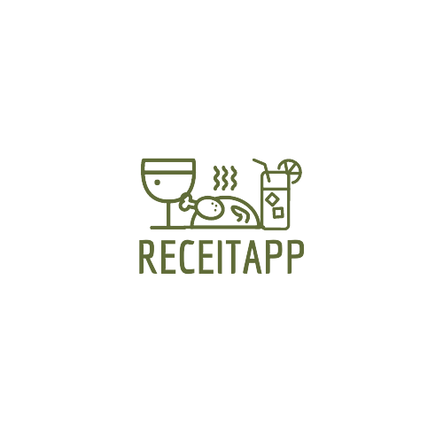
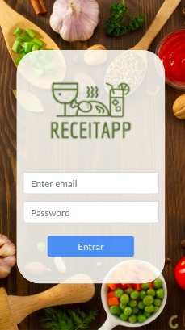
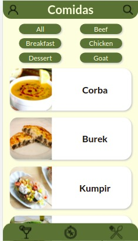
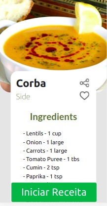

<div align="center">
 
</div>

<h1 align="center">
  Projeto ReceitApp
</h1>

<p align="center">
  <a href="#-tecnologias">Tecnologias</a>&nbsp;&nbsp;&nbsp;|&nbsp;&nbsp;&nbsp;
  <a href="#-projeto">Projeto</a>&nbsp;&nbsp;&nbsp;|&nbsp;&nbsp;&nbsp;
  <a href="#-como-executar-o-projeto">Como executar o projeto</a>&nbsp;&nbsp;&nbsp;|&nbsp;&nbsp;&nbsp;
  <a href="#-deploy">Deploy</a>&nbsp;&nbsp;&nbsp;|&nbsp;&nbsp;&nbsp;
  <a href="#-como-contribuir-no-projeto">Como contribuir no projeto</a>&nbsp;&nbsp;&nbsp;|&nbsp;&nbsp;&nbsp;
  <a href="#-autor">Autor</a>
</p>

<p align="center">
 
</p>

<br>

<p align="center">
  
  
  
</p>

## 🚀 Tecnologias

Esse projeto foi desenvolvido com as seguintes tecnologias:

- HTML
- CSS
- React
- React-Redux
- Bootstrap

## 💻 Projeto

O projeto ReceitApp, consiste em uma aplicação Front-End, que simula um aplicativo mobile para realização de receitas, realizando requisições a duas APIS, TheMealDB e The CockTailDB. Possuindo página de receitas, para bebidas e comidas, exploração de novas receitas, acompanhamento do andamento das receitas e sistema de receitas favoritas.

Este projeto foi realizado em grupo, pelos seguintes integrantes:
- Isaac Cruz;
- Teófilo Brandão ([GitHub](https://github.com/teofilobrandao));
- Renata Nunes ([GitHub](https://github.com/renatapnunes));
- Eurides Alves ([GitHub](https://github.com/EuridesAlves));
- Alice Gonçalves ([GitHub](https://github.com/AliceGS19));

## 🚀 Como executar o projeto

### Pré-requisitos

Antes de começar, você vai precisar ter instalado em sua máquina as seguintes ferramentas:
[Git](https://git-scm.com), [Node.js](https://nodejs.org/en/). 
Além disto é bom ter um editor para trabalhar com o código como [VSCode](https://code.visualstudio.com/)

### 🎲 Rodando a Aplicação

```bash

# Clone este repositório
$ git clone git@github.com:IsaacCruzLM/ReceitApp.git

# Acesse a pasta do projeto no terminal/cmd
$ cd ReceitApp

# Instale as dependências
$ npm install

# Execute a aplicação em modo de desenvolvimento
$ npm start

# O servidor inciará na porta:3000 - acesse http://localhost:3000

```

## 🔖 Deploy

Você pode visualizar a aplicação do projeto através [desse link](https://isaaccruzlm.github.io/ReceitApp/).

Obs: Esta aplicação foi realizada para um view mobile, para uma melhor expriência, recomenda-se utilizar uma view com dimensões de 320 x 568 (iPhone 5/SE) ou similares.

---

## 💪 Como contribuir no projeto

1. Faça um **fork** do projeto.
2. Crie uma nova branch com as suas alterações: `git checkout -b my-feature`
3. Salve as alterações e crie uma mensagem de commit contando o que você fez: `git commit -m "feature: My new feature"`
4. Envie as suas alterações: `git push origin my-feature`

---

## 🦸 Autor

<a href="https://www.linkedin.com/in/isaaccruzz/">
 
 <br />
 <sub><b>Isaac Cruz</b></sub></a>
 <br />

[](https://www.linkedin.com/in/isaaccruzz/) 
[](mailto:isaac.clm1@gmail.com)

---

Feito com ❤️ por Isaac Cruz👋🏽 [Entre em contato!](https://www.linkedin.com/in/isaaccruzz/)

---
